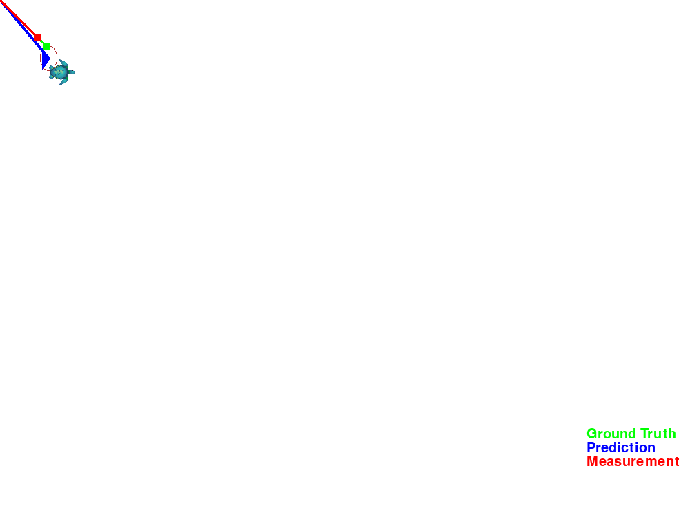
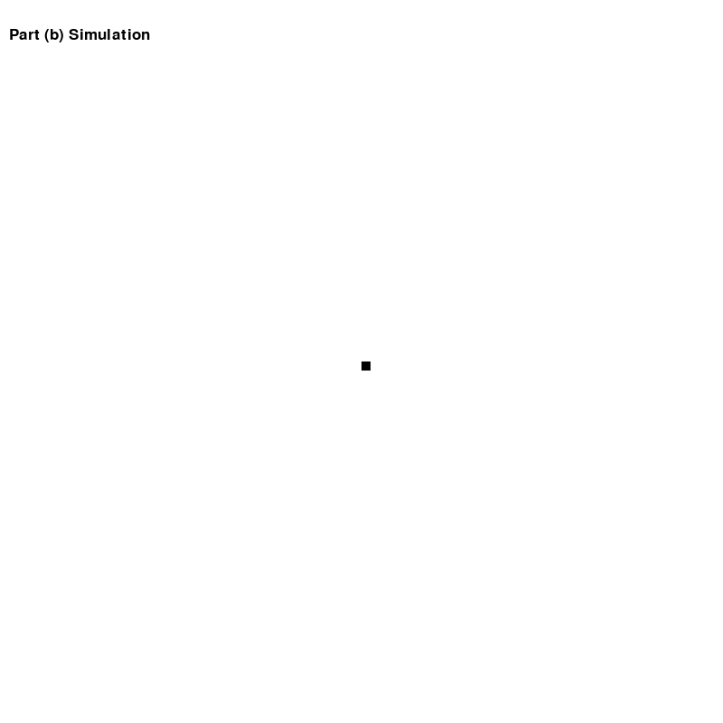

# ME8135 - Directed Studies: State Estimation
Project repo for ME8135  
Prof: Dr. Sajad Saeedi  
Author: Arash Tabrizi  
Toronto Metropolitan University, ON, CA  
# A1 Solutions  
Please refer to A1 folder  
# A2 Solutions  
Please refer to [Link to PDF](A2/SolA2_Arash.pdf)

## Q1 Animation:

## Q2 Part(a) Animation:

## Q2 Part(b) Animation:

